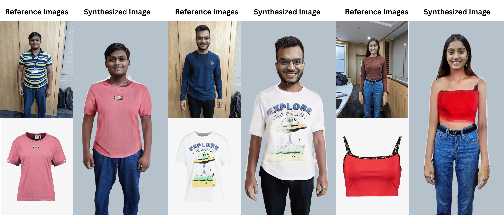
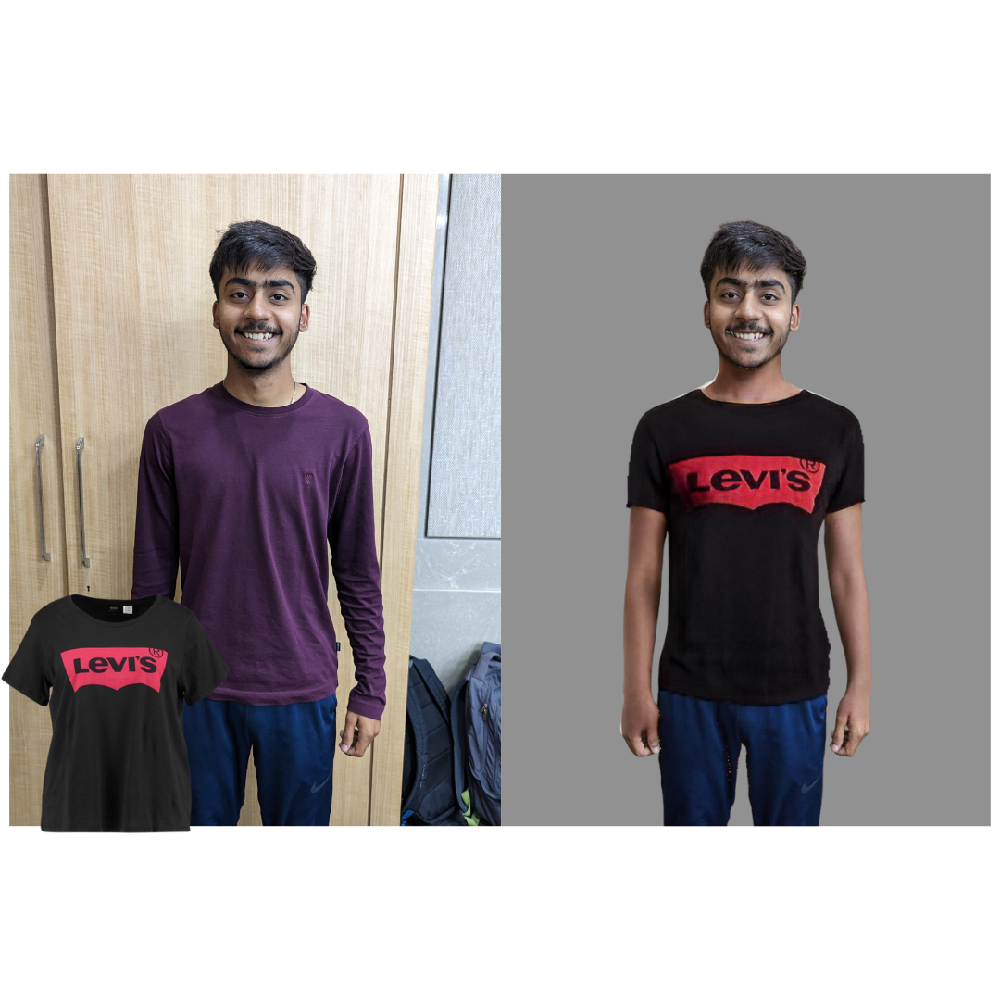
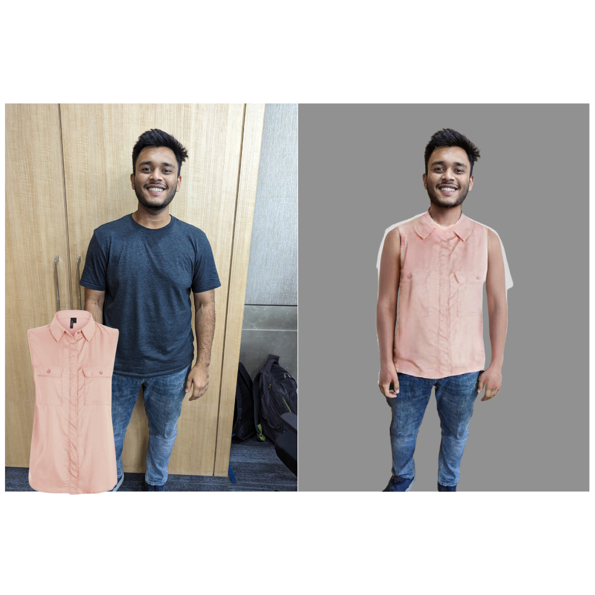
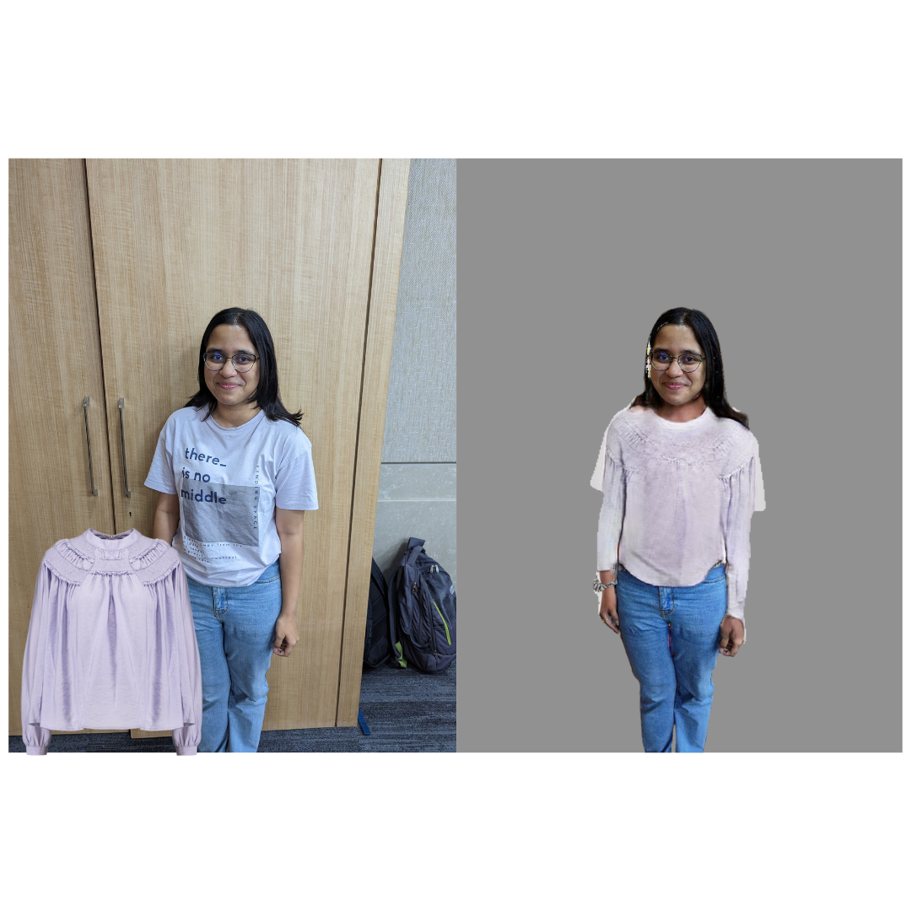
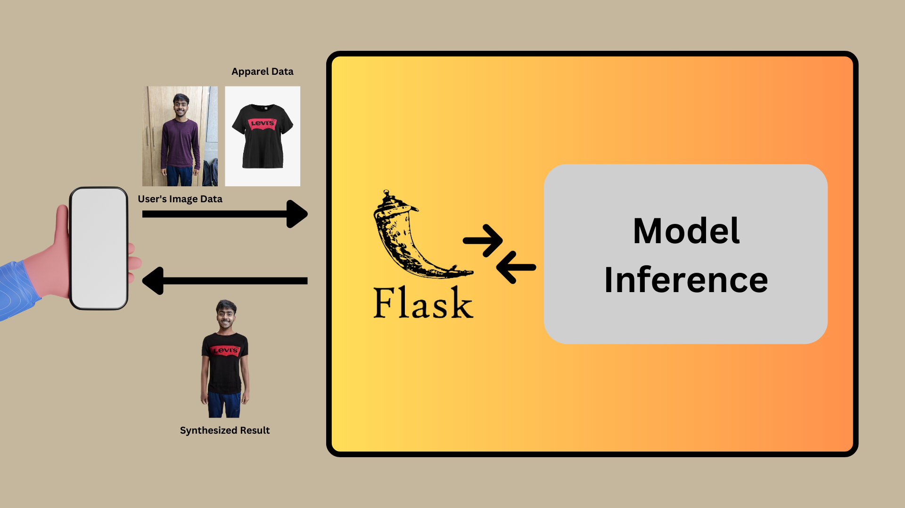

# Vastra - Visual Cloth Try On using HR-VITON.

## Implementation on Colab (Custom Input)
We have implemented the process on Google Colab to try and run the model against custom inputs.

]

## Problem Statement
**Revolutionizing the Clothing Shopping Experience with Advanced Virtual Try-On Technology**
Provide a unique solution that provides clients with a smooth virtual try-on experience for the company's portfolio of clothing. The solution should utilize cutting-edge augmented reality (AR) or virtual reality (VR) technology to deliver an immersive and customized experience that allows customers to imagine how garments appear on them in real-time.

## Our Approach

As we started working on the problem statement, we thought of two plausible solutions.

 - **Solution 1**
	 - Input user's image which they'd like to use for try on.
	 - Use *open-cv* to process the image and extract the facial data of the user.
	 - Use *open-cv* again to super-impose the user's facial data on dummy models. This serves the purpose of a Try-0n.

Soon enough, we realised that this solution is not robust as the user wants to try out the clothes on their bodies than dummy/model bodies. 

- **Solution 2** (*What we implemented*)
We started researching and reading all the available papers and articles about virtual try on.  After skimming through dozens of papers and articles. We came across **HR-VITON**.  
**HR-VITON** is a PyTorch based implmentation of the paper ***High-Resolution Virtual Try-On with Misalignment and Occlusion-Handled Conditions*** by **Sangyun Lee** . It is a Deep Learning model that uses a person's image and a garment's image to generate a synthesized image. This is a 2D approach to the problem of virtual try on. While other approaches focus on the 3D coordinates of the garments and the user. HR-VITON used images to produce results that are effortless. 
HR-VITON is trained on the VITON-HD dataset. **VITON-HD** dataset is a dataset for high-resolution (i.e., 1024x768) virtual try-on of clothing items. Specifically, it consists of 13,679 frontal-view woman and top clothing image pairs.
In our approach, we used **HR-VITON** to produce try on results of various custom inputs of users and garments. 

## Process Overview

The task at hand takes 5 steps. 
1. Remove the background from user's input image.
2. Use DensePose to detect the pose in the given image.
3. Use segmentation to differentiate between different sectors of the image.
4. Use PoseNet to generate the pose data of the user. This data is used to calculate the warp of clothing required to properly synthesize both images.
5. Apply segmentation to the cloth image.

All these values are then passed to the HR-VITON model and gives us our required output.

## Code Overview
- get_cloth_mask.py
	- 	get_cloth_mask.py is a Python script that uses a pre-trained model to create a binary mask of clothing from an input image. It loads an input image, applies normalization transformation, pads it to a multiple of 32, and converts it to a PyTorch tensor. It passes the tensor through a pre-trained model to obtain the mask and then threshold it to create a binary mask. It overlays the original image on top of a white background using the mask and saves the resulting image and the binary mask to files.
- get_densepose.py
	- 	get_densepose.py is a Python script that takes a JSON file containing dense pose annotations for an input image and produces a visualization of the dense pose segmentation. It loads the JSON file, reads the segmentation information, and maps each segment to a predefined color in the colormap dictionary. It then creates an RGB image with the same size as the input image and overlays the segmented regions on top of a black background. Finally, it saves the resulting image to a file in the output directory.
- get_seg_grayscale.py
	- 	This is a Python script that takes an input image and converts it into a grayscale segmentation map using predefined color values for different body parts. The input image is opened using the PIL library, and its size is extracted. The color values for different body parts are defined using an RGB colormap. The script then iterates over every pixel in the input image and assigns a grayscale value according to the corresponding color in the colormap. The resulting grayscale image is resized using OpenCV's resize function and saved as a PNG file using the PIL library.
- posenet.py
	- 	This code is a Python script that uses the PoseNet deep learning model to detect human poses in an image and save the resulting keypoints in a JSON file. 
- main.py
	- 	This is the driver code for our implementation.
		- 	It reads an input image from the path "./static/origin_web.jpg" and resizes it to 768x1024 pixels.
		- 	It resizes the image to 384x512 pixels and saves it as "resized_img.jpg".
		- 	It runs all the necessary modules as and when required.

## Test Cases
Here are a few inputs and their respective output generated.

1. 
2. 
3. 

## Planned Architecture

## Limitations
- As the dataset was primarily of women. There are certain artefacts when trying to generate output of men's clothing.
- As the dataset didn't have any bottomwear. Therefore, the model can only work for tops/tshirts.
- There is a known bug that crashes the scripts for some unidentified reason. If the given cloth image is named 'cloth_web.jpg' and if the given user image is named 'origin_web.jpg'.
- The model starts failing at medium level poses.

## References
#### HR-VITON
https://github.com/sangyun884/HR-VITON
#### Posenet
https://github.com/rwightman/posenet-python
#### Graphonomy
https://github.com/Gaoyiminggithub/Graphonomy
#### detectron2
https://github.com/facebookresearch/detectron2
#### cloth image segmentation
https://github.com/ternaus/cloths_segmentation
